# lumen-xarray

**Native xarray support for Lumen - SQL-queryable N-dimensional scientific data**

[]()
[]()
[]()

Part of the [HoloViz](https://holoviz.org/) ecosystem - extends [Lumen](https://github.com/holoviz/lumen) to work with N-dimensional scientific data.

> Related: [holoviz/lumen#1508](https://github.com/holoviz/lumen/issues/1508) | [holoviz/lumen#1434](https://github.com/holoviz/lumen/pull/1434)

---

## The Problem

[Lumen](https://github.com/holoviz/lumen) is a framework for building AI-powered data applications. It currently operates on **tabular data** (CSV, Parquet, SQL) via DuckDB. Scientists and researchers, however, work with **N-dimensional labeled datasets** - temperature grids across time/lat/lon, satellite imagery, genomics matrices - stored in NetCDF, Zarr, HDF5, and GRIB.

**lumen-xarray** bridges this gap: it registers xarray datasets with [Apache DataFusion](https://datafusion.apache.org/) (via [xarray-sql](https://github.com/alxmrs/xarray-sql)) and exposes them through Lumen's Source API. This lets Lumen AI agents generate SQL queries against scientific data and makes the full pipeline ecosystem work with multidimensional data.

---

## Interactive Dashboard

The dashboard auto-adapts to **any** xarray dataset - widgets, tabs, and SQL queries are generated dynamically from the data's dimensions and variables. Users can upload their own files or enter paths/URLs at runtime.


<details>
<summary><strong>More screenshots</strong></summary>

| Tab | Screenshot |
|-----|-----------|
| Spatial Heatmap | 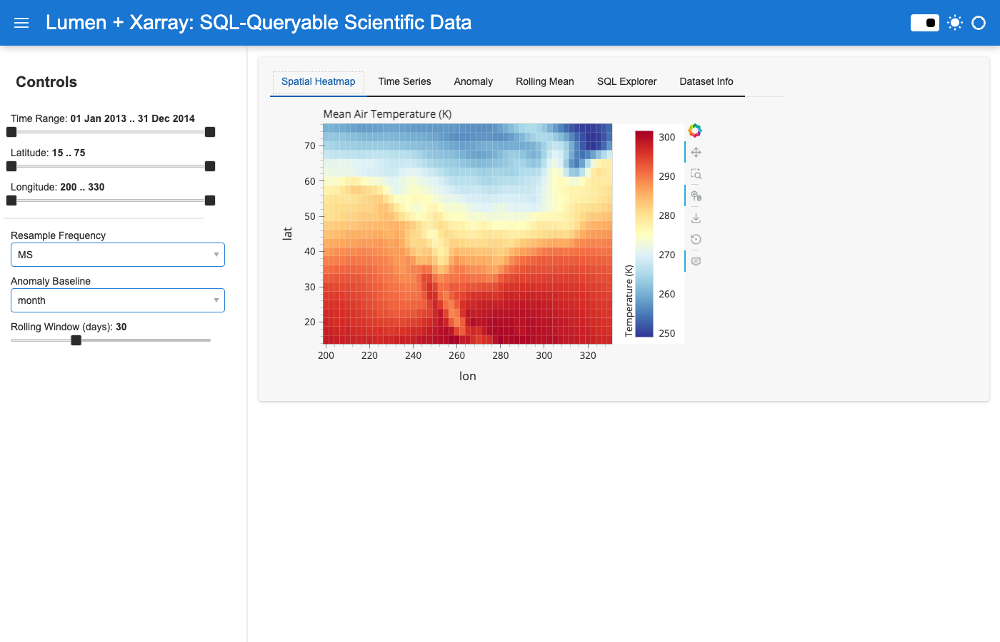 |
| Time Series | 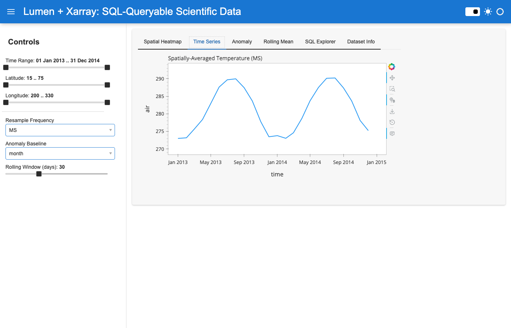 |
| Anomaly Analysis | 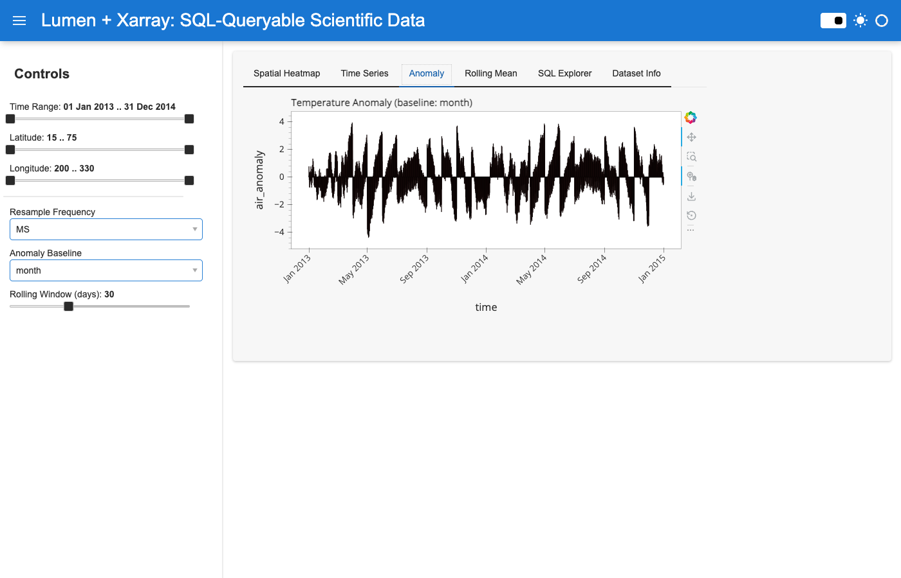 |
| Rolling Mean | 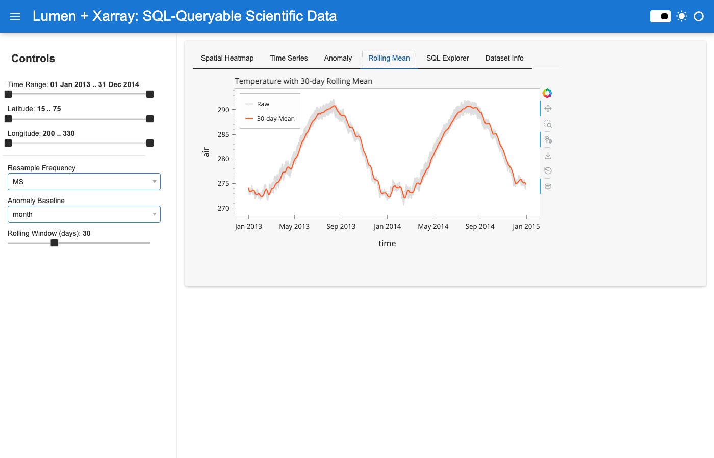 |
| SQL Explorer | 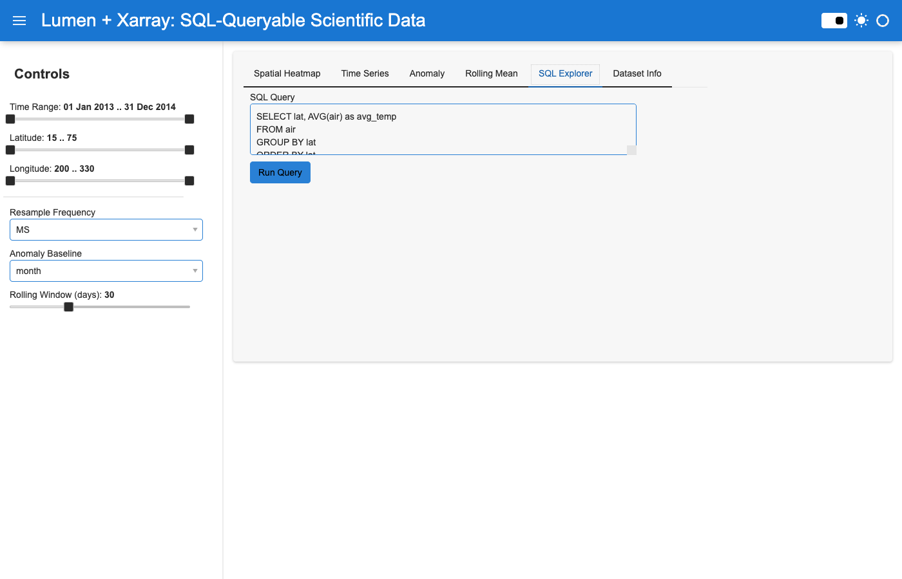 |
| Dataset Info | 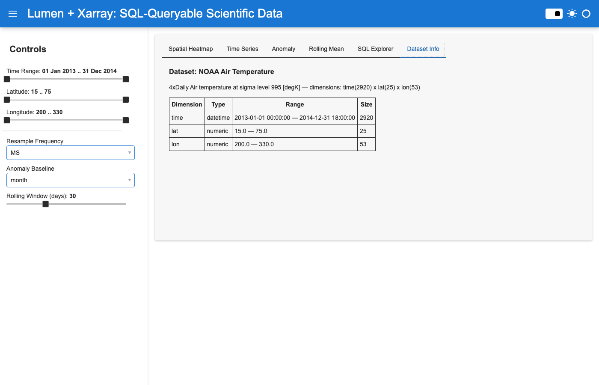 |

</details>

<details>
<summary><strong>Custom multi-variable dataset</strong></summary>

| Tab | Screenshot |
|-----|-----------|
| Full View | 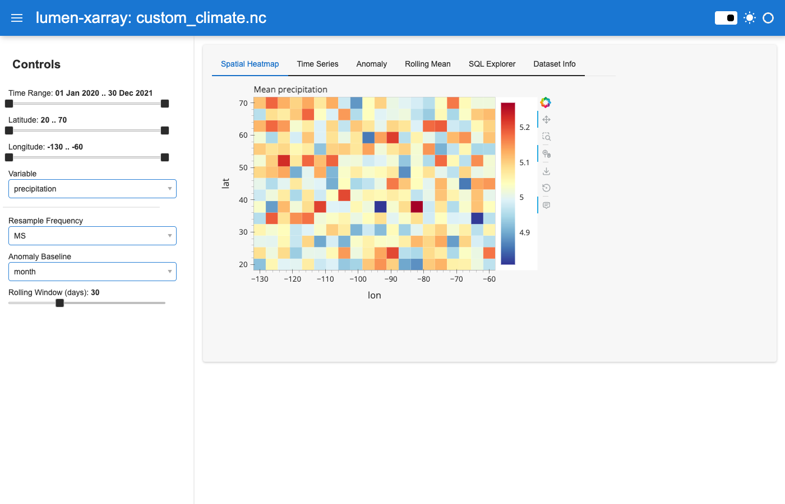 |
| Spatial Heatmap | 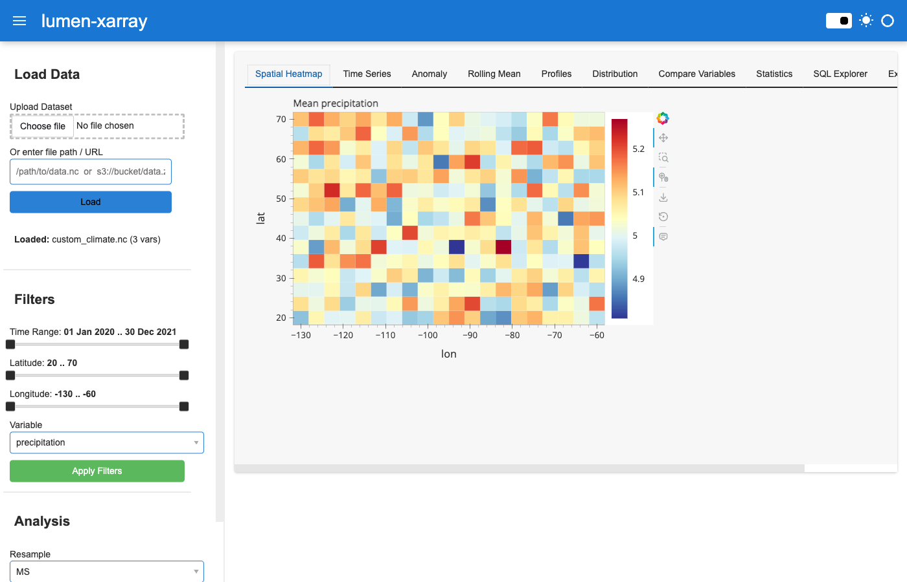 |
| Time Series | 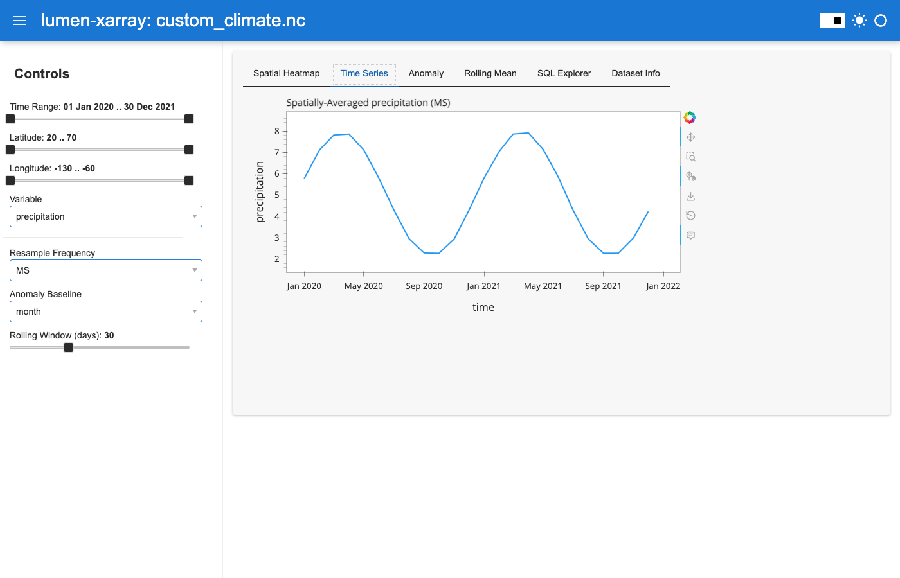 |
| Anomaly | 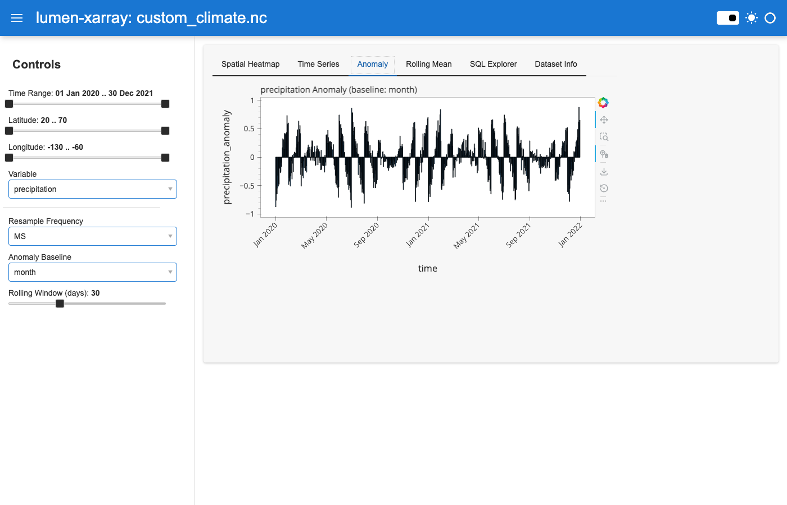 |
| Rolling Mean | 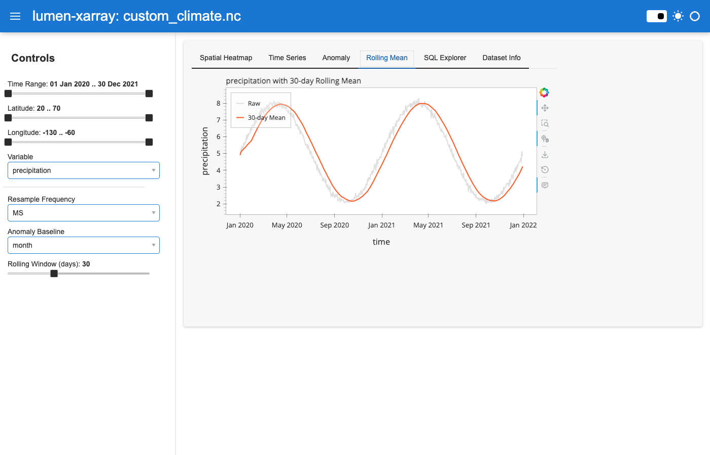 |
| Distribution | 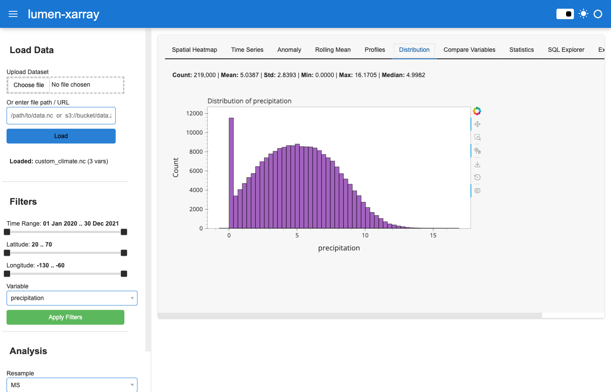 |
| Compare Variables | 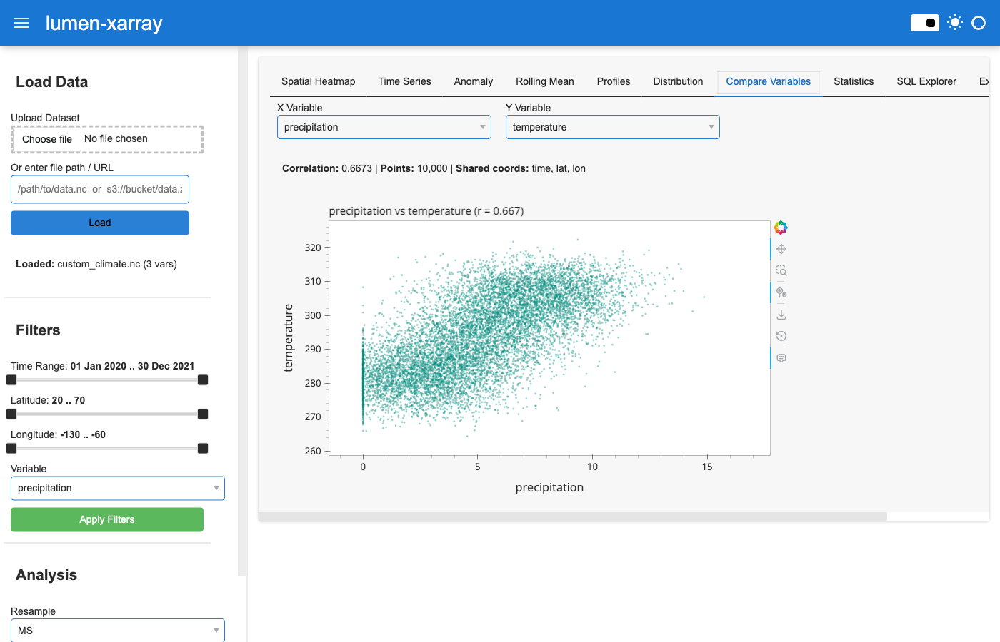 |
| Statistics | 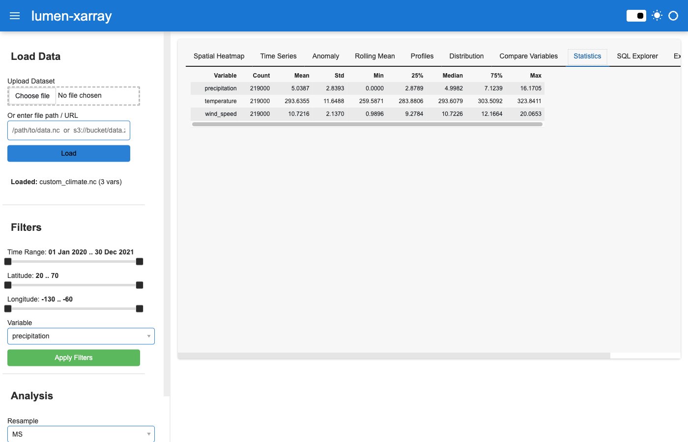 |
| SQL Explorer | 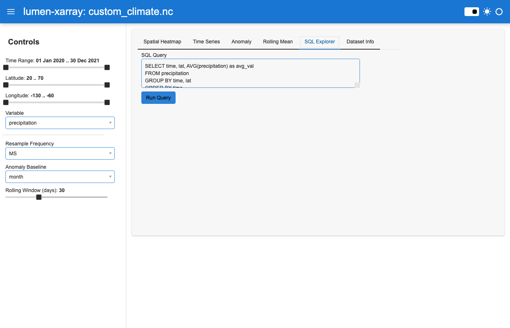 |
| Dataset Info | 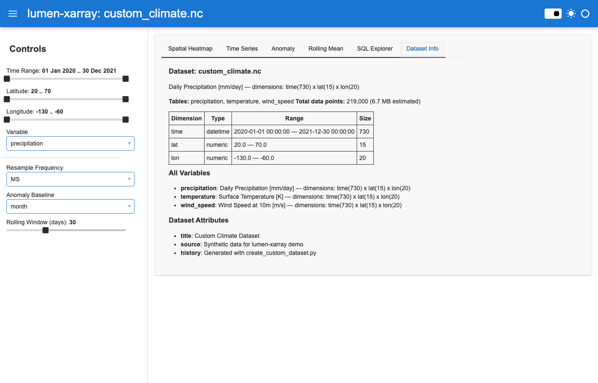 |

</details>

### Run the Dashboard

```bash
# Demo dataset (NOAA air temperature)
PYTHONPATH=. panel serve examples/dashboard.py --show

# Your own NetCDF / Zarr / HDF5 / GRIB file
PYTHONPATH=. panel serve examples/dashboard.py --show --args my_data.nc
PYTHONPATH=. panel serve examples/dashboard.py --show --args output.zarr
PYTHONPATH=. panel serve examples/dashboard.py --show --args satellite.h5
```

The dashboard automatically:
- Detects time, lat/lon, and arbitrary dimensions - generates appropriate filter widgets
- Creates spatial heatmap, time series, anomaly, rolling mean, distribution, and profile tabs based on available dimensions
- Supports multi-variable datasets with a variable selector and cross-variable scatter plots with correlation
- Allows uploading new datasets or loading from file path / URL at runtime
- Shows dataset statistics, metadata, size estimates, a SQL explorer, and data export (CSV/Parquet/JSON)

---

## Quick Start

```python
import xarray as xr
from lumen_xarray import XArraySQLSource

# Load any xarray dataset
ds = xr.tutorial.open_dataset("air_temperature")
source = XArraySQLSource(_dataset=ds)

# SQL queries over scientific data
df = source.execute("""
    SELECT lat, AVG(air) as avg_temp
    FROM air
    WHERE lat > 60
    GROUP BY lat
    ORDER BY lat
""")

# From files
source = XArraySQLSource(uri="climate_data.nc")
source = XArraySQLSource(uri="output.zarr", engine="zarr")

# Remote data
source = XArraySQLSource(uri="s3://bucket/data.zarr", engine="zarr")
source = XArraySQLSource(uri="https://thredds.server.org/data.nc")

# Lumen Source API
source.get_tables()           # ['air']
source.get_schema("air")      # {column: {type, min, max, ...}, __len__: N}
source.get_metadata("air")    # {description, columns, dimensions, shape, ...}
source.get_dimension_info()   # {time: {type, min, max, size}, lat: {...}, ...}
source.get("air", lat=75.0)   # Filtered DataFrame
source.estimate_size("air")   # {rows, estimated_mb, exceeds_warning}

# Async (for Lumen AI agents)
df = await source.execute_async("SELECT * FROM air LIMIT 100")
```

### Multi-Variable Datasets

```python
ds = xr.Dataset({
    "temperature": (["time", "lat", "lon"], temp_data),
    "pressure":    (["time", "lat", "lon"], pres_data),
}, coords={"time": times, "lat": lats, "lon": lons})

source = XArraySQLSource(_dataset=ds)
source.get_tables()  # ['pressure', 'temperature']

source.execute("SELECT lat, AVG(temperature) FROM temperature GROUP BY lat")
source.execute("SELECT lat, AVG(pressure) FROM pressure GROUP BY lat")
```

### Transforms

```python
from lumen_xarray import DimensionSlice, SpatialBBox, TimeResample, Anomaly, RollingWindow

df = source.execute("SELECT * FROM air")
df = DimensionSlice(dimension="time", start="2013-06-01", stop="2013-12-31").apply(df)
df = SpatialBBox(lat_min=30, lat_max=60, lon_min=200, lon_max=280).apply(df)
df = TimeResample(time_col="time", freq="MS").apply(df)
df = Anomaly(time_col="time", value_col="air", groupby="month").apply(df)
df = RollingWindow(column="air", window=30).apply(df)
```

---

## SQL Showcase

### Spatial Analysis

```python
source.execute("SELECT lat, lon, AVG(air) FROM air GROUP BY lat, lon")
```
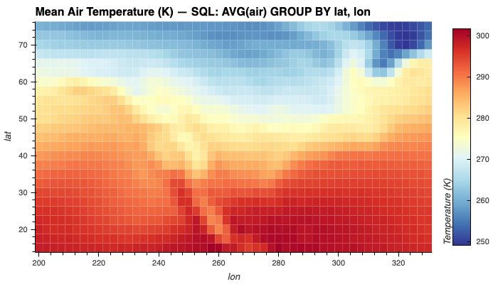

### Latitude Profile

```python
source.execute("SELECT lat, AVG(air), MIN(air), MAX(air) FROM air GROUP BY lat")
```
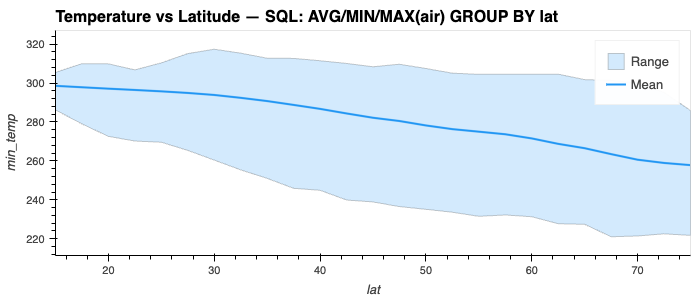

### Climate Zones (CASE WHEN)

```python
source.execute("""
    SELECT CASE WHEN lat >= 60 THEN 'Arctic'
                WHEN lat >= 30 THEN 'Temperate'
                ELSE 'Tropical' END as zone,
           AVG(air) FROM air GROUP BY zone
""")
```
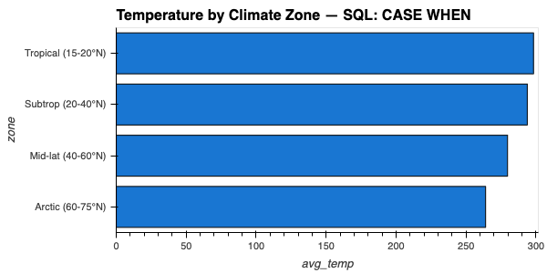

### Monthly Averages (EXTRACT)

```python
source.execute("SELECT EXTRACT(MONTH FROM time) as m, AVG(air) FROM air GROUP BY m")
```
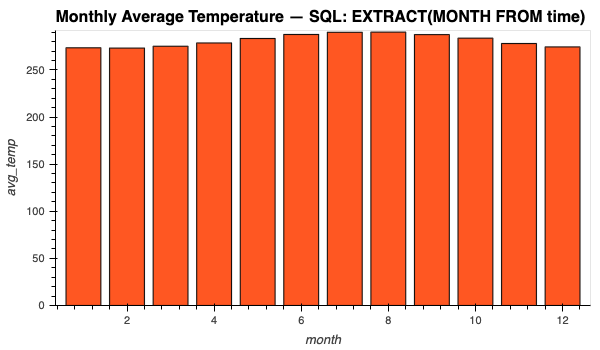

### Anomaly Pipeline

```python
df = DimensionAggregate(dimensions=["lat", "lon"], method="mean").apply(df)
df = TimeResample(time_col="time", freq="MS").apply(df)
df = Anomaly(time_col="time", value_col="air", groupby="month").apply(df)
```
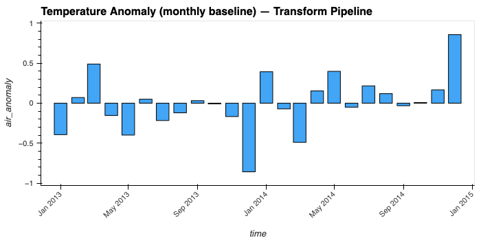

---

## Architecture

```
NetCDF / Zarr / HDF5 / GRIB / Remote URLs
    |
    v
xarray.open_dataset()  (lazy, dask-chunked)
    |
    +---> XArraySQLSource (BaseSQLSource)
    |       |
    |       v
    |   xarray-sql: XarrayContext (Apache DataFusion)
    |       |
    |       v
    |   SQL queries --> pandas DataFrames
    |       |
    |       v
    |   Lumen Pipeline / AI Agents / Dashboard
    |
    +---> XArraySource (Source)
            |
            v
        Native xarray ops --> pandas DataFrames --> Lumen Pipeline
```

## API Reference

### Sources

| Component | Base Class | SQL | Use Case |
|-----------|-----------|-----|----------|
| `XArraySQLSource` | `BaseSQLSource` | DataFusion | Lumen AI, SQL queries, full pipeline integration |
| `XArraySource` | `Source` | No | Programmatic access, native xarray operations |

### XArraySQLSource Methods

| Method | Description |
|--------|-------------|
| `execute(sql)` | Run any SQL query via DataFusion |
| `execute_async(sql)` | Async version for Lumen AI agents |
| `get(table, **filters)` | Filtered DataFrame with SQL transform support |
| `get_async(table, **filters)` | Async filtered access |
| `get_schema(table)` | JSON schema with types, min/max, enums |
| `get_metadata(table)` | Rich metadata from xarray attributes |
| `get_dimension_info(table)` | Coordinate ranges, types, step sizes |
| `get_tables()` | List data variables as SQL tables |
| `normalize_table(name)` | Fuzzy table name matching for AI agents |
| `estimate_size(table)` | Memory estimation for large dataset safety |
| `to_spec()` / `from_spec()` | Lumen YAML serialization |

### Transforms

| Transform | Description |
|-----------|-------------|
| `DimensionSlice` | Slice by range, values, or nearest match along any dimension |
| `SpatialBBox` | Filter to a lat/lon bounding box |
| `DimensionAggregate` | Reduce dimensions - auto-detects coordinates vs. data columns |
| `TimeResample` | Resample time series (daily to monthly, etc.) with spatial grouping |
| `Anomaly` | Deviations from climatological mean (monthly, seasonal, overall) |
| `RollingWindow` | Moving average/sum/std for time series smoothing |

### AI Integration (`lumen_xarray.ai`)

| Hook | Purpose |
|------|---------|
| `is_xarray_path()` | Detect `.nc`, `.zarr`, `.h5`, `.grib` files and URLs |
| `resolve_xarray_source()` | Create source from file path (`lumen-ai serve data.nc`) |
| `handle_xarray_upload()` | Process uploaded files in Lumen AI UI |
| `register_xarray_handlers()` | Patch Lumen AI to recognize xarray file types |
| `build_xarray_source_code()` | Generate Python source code for AIHandler |

### Supported Formats

| Format | Extensions | Engine | Remote |
|--------|-----------|--------|--------|
| NetCDF | `.nc`, `.nc4`, `.netcdf` | `netcdf4` | OpenDAP URLs |
| Zarr | `.zarr` | `zarr` | S3, GCS, HTTP via fsspec |
| HDF5 | `.h5`, `.hdf5`, `.he5` | `h5netcdf` | -- |
| GRIB | `.grib`, `.grib2`, `.grb` | `cfgrib` | -- |

---

## Lumen Pipeline Integration

lumen-xarray works with Lumen's full pipeline system - the same way DuckDB or other SQL sources do:

```python
from lumen.pipeline import Pipeline

pipeline = Pipeline(source=source, table="air")
data = pipeline.data  # pandas DataFrame

# With transforms
pipeline = Pipeline(
    source=source,
    table="air",
    transforms=[
        DimensionAggregate(dimensions=["lat", "lon"], method="mean"),
        TimeResample(time_col="time", freq="MS"),
    ],
)

# SQL transforms forwarded to DataFusion
source.get("air", sql_transforms=[SQLFilter(conditions=[("lat", ">", 60)])])

# Fuzzy table name matching for AI agents
source.normalize_table("AIR")        # -> "air"
source.normalize_table('"air"')      # -> "air"

# Async for non-blocking AI workflows
df = await source.execute_async("SELECT * FROM air LIMIT 100")

# Memory safety
source.estimate_size("air")
# {'rows': 3869000, 'estimated_mb': 118.1, 'exceeds_warning': False}
```

---

## Test Suite

```
$ pytest tests/ -v
======================= 126 passed in 3.57s ========================
```

| Module | Tests | Covers |
|--------|-------|--------|
| `test_sql_source.py` | 50 | Construction, SQL, schema, metadata, normalize_table, estimate_size, async, serialization |
| `test_basic_source.py` | 27 | Source API, filtering, native xarray ops, file I/O |
| `test_transforms.py` | 35 | All 6 transforms + integration (chaining) tests |
| `test_ai_integration.py` | 14 | Path detection, source resolution, file upload, code generation |

---

## Installation

```bash
git clone https://github.com/ghostiee-11/lumen-xarray.git
cd lumen-xarray
pip install -e ".[all,test,examples]"
```

**Core dependencies:** `lumen`, `xarray`, `xarray-sql`, `pandas`, `numpy`, `param`

## Project Structure

```
lumen-xarray/
├── lumen_xarray/
│   ├── __init__.py           # Public API
│   ├── source.py             # XArraySQLSource - SQL via DataFusion
│   ├── basic_source.py       # XArraySource - native xarray ops
│   ├── transforms.py         # 6 scientific data transforms
│   └── ai.py                 # Lumen AI integration hooks
├── tests/                    # 126 tests
├── examples/
│   ├── quickstart.py         # Basic usage
│   ├── sql_queries.py        # SQL patterns
│   ├── lumen_pipeline.py     # Lumen Pipeline integration demo
│   └── dashboard.py          # Interactive Panel dashboard
├── assets/                   # Screenshots
├── pyproject.toml
└── README.md
```

## Design Decisions

1. **DataFusion over DuckDB** - xarray-sql uses Apache DataFusion. We set `dialect="postgres"` for sqlglot since DataFusion's SQL is PostgreSQL-compatible.

2. **Two source classes** - `XArraySQLSource` for Lumen AI (agents need `execute()`), `XArraySource` for programmatic use with native xarray ops.

3. **Per-variable tables** - Each data variable becomes a SQL table. Coordinates (time, lat, lon) become columns in each table.

4. **Auto-chunking** - xarray-sql requires chunked data. Default `chunks="auto"` uses full dimension sizes for lazy loading.

5. **Coordinate-aware aggregation** - `DimensionAggregate` auto-detects coordinate columns vs. data columns, so grouping and averaging work correctly.

6. **Fuzzy table matching** - `normalize_table()` handles case differences and quoting that AI agents sometimes produce.

7. **Async-first for AI** - `execute_async()` and `get_async()` run in thread pools for non-blocking agent workflows.

8. **Adaptive dashboard** - Widgets and tabs auto-generate from dataset dimensions. Works with any xarray dataset, not just the demo.

## License

BSD-3-Clause
