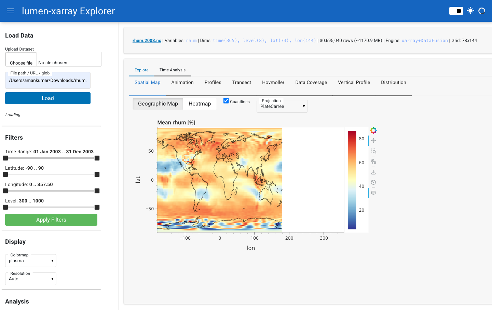
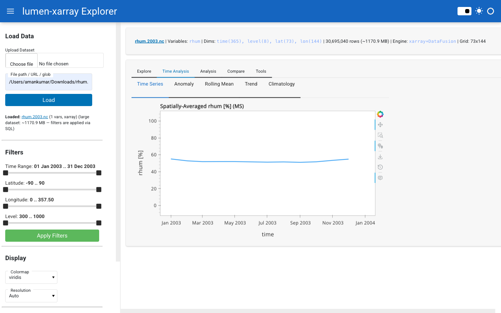
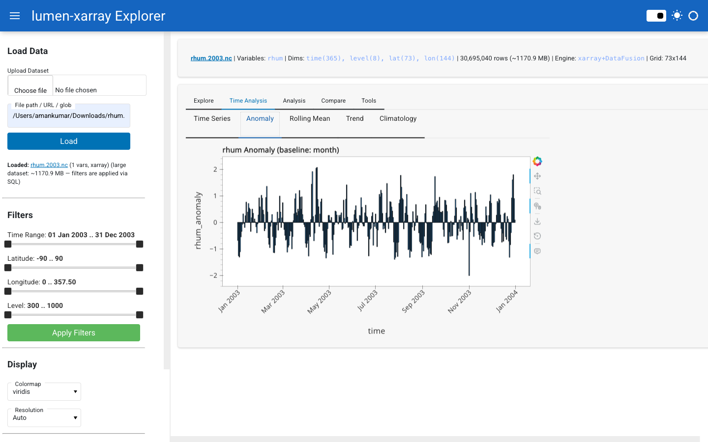
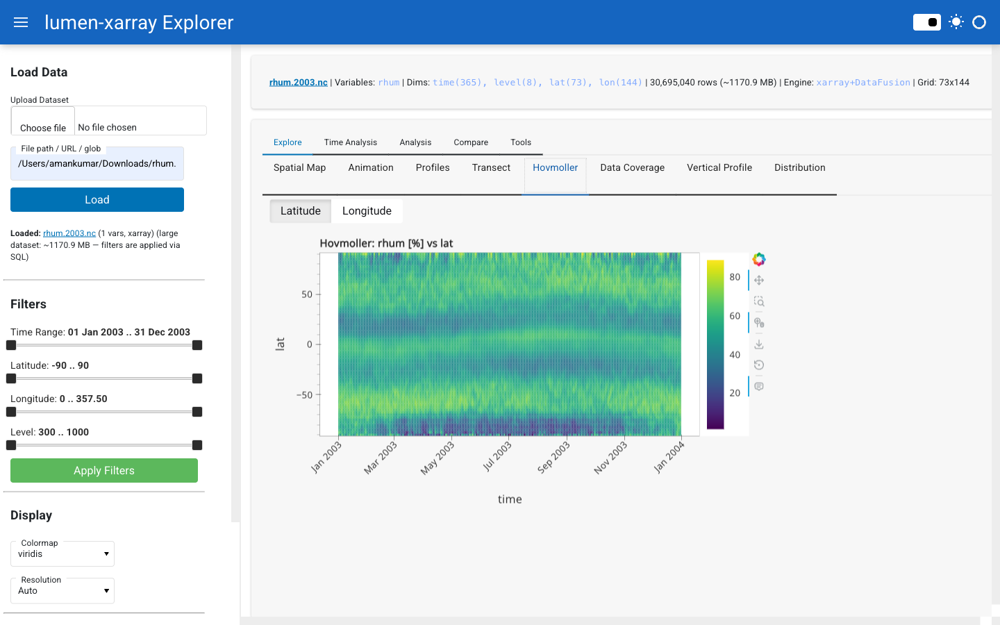
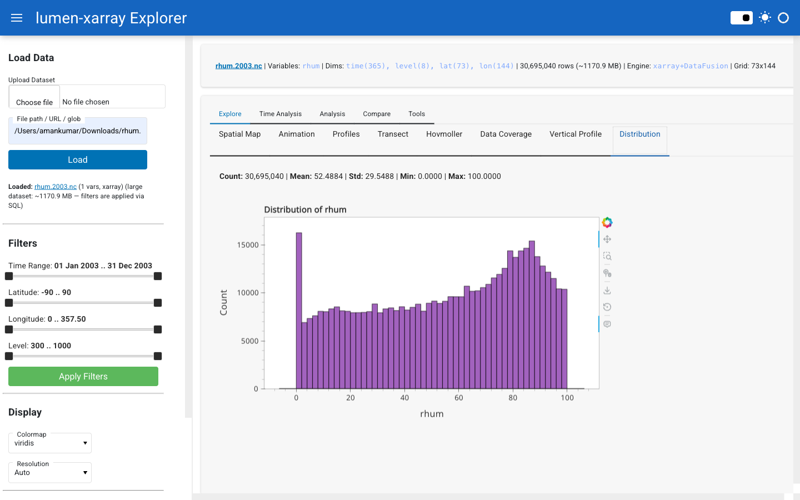
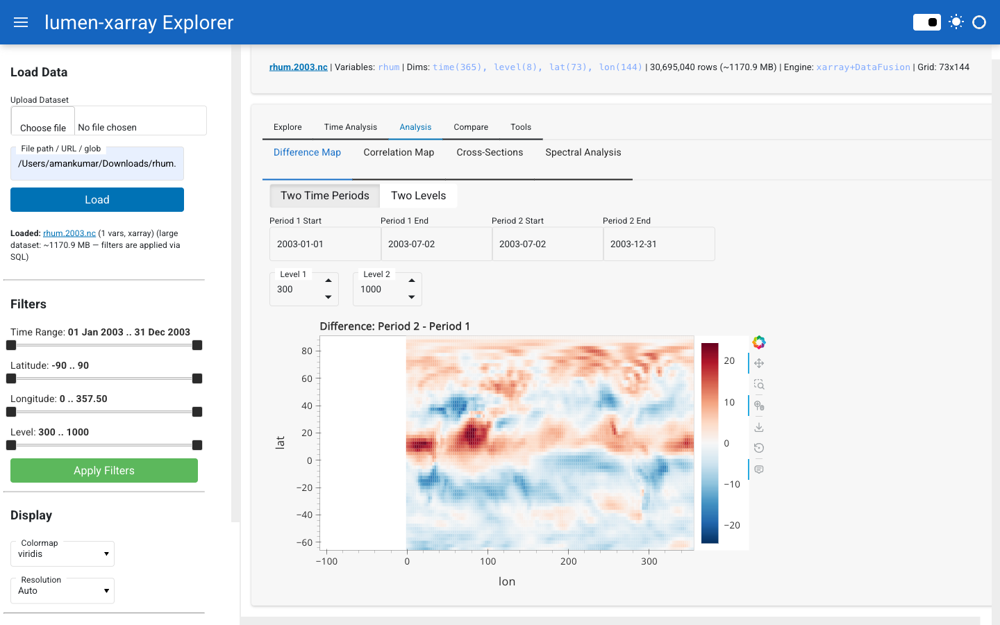
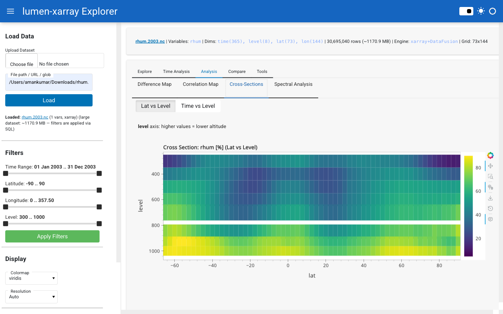
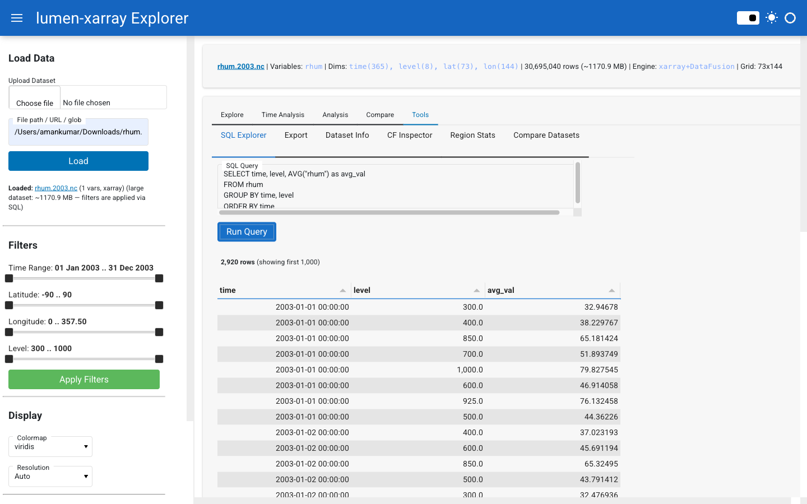
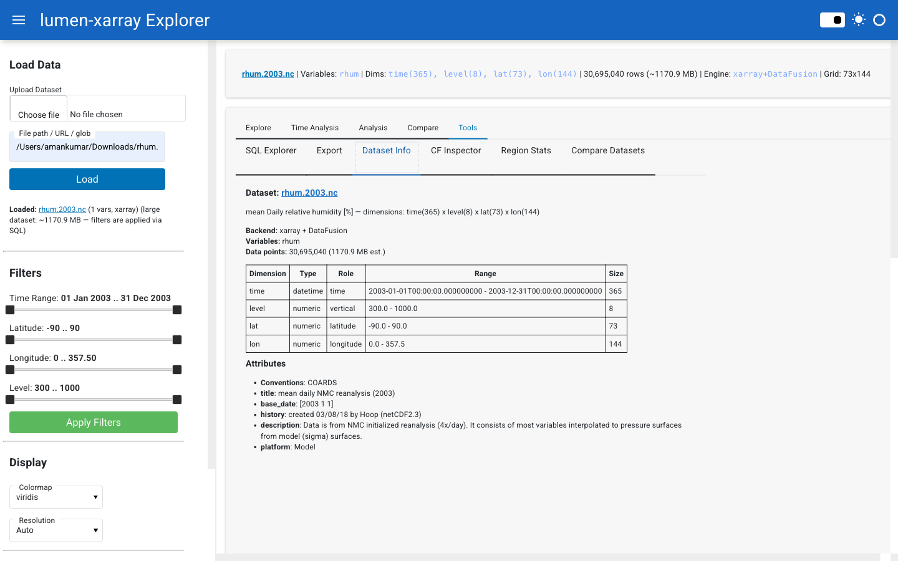

<p align="center">
  <a href="https://github.com/holoviz/lumen">
    
  </a>
  &nbsp;&nbsp;&nbsp;
  <span style="font-size: 2em; vertical-align: middle;">+</span>
  &nbsp;&nbsp;&nbsp;
  <a href="https://xarray.dev/">
    
  </a>
</p>

<h1 align="center">lumen-xarray</h1>

<p align="center">
  <strong>Native xarray support for Lumen - SQL-queryable N-dimensional scientific data</strong>
</p>

<p align="center">
  
  
  
</p>

<p align="center">
  Part of the <a href="https://holoviz.org/">HoloViz</a> ecosystem - extends <a href="https://github.com/holoviz/lumen">Lumen</a> to work with N-dimensional scientific data.
</p>

<p align="center">
  Related: <a href="https://github.com/holoviz/lumen/issues/1508">holoviz/lumen#1508</a> | <a href="https://github.com/holoviz/lumen/pull/1434">holoviz/lumen#1434</a>
</p>

---

## The Problem

[Lumen](https://github.com/holoviz/lumen) is a framework for building AI-powered data applications. It currently operates on **tabular data** (CSV, Parquet, SQL) via DuckDB. Scientists and researchers, however, work with **N-dimensional labeled datasets** - temperature grids across time/lat/lon, satellite imagery, genomics matrices - stored in NetCDF, Zarr, HDF5, and GRIB.

**lumen-xarray** bridges this gap: it registers xarray datasets with [Apache DataFusion](https://datafusion.apache.org/) (via [xarray-sql](https://github.com/alxmrs/xarray-sql)) and exposes them through Lumen's Source API. This lets Lumen AI agents generate SQL queries against scientific data and makes the full pipeline ecosystem work with multidimensional data.

---

## Built With

<p align="center">
  <a href="https://github.com/holoviz/lumen"></a>&nbsp;&nbsp;
  <a href="https://panel.holoviz.org/"></a>&nbsp;&nbsp;
  <a href="https://holoviews.org/"></a>&nbsp;&nbsp;
  <a href="https://hvplot.holoviz.org/"></a>&nbsp;&nbsp;
  <a href="https://geoviews.org/"></a>&nbsp;&nbsp;
  <a href="https://xarray.dev/"></a>&nbsp;&nbsp;
  <a href="https://datafusion.apache.org/"></a>&nbsp;&nbsp;
  <a href="https://bokeh.org/"></a>
</p>

---

## Features

| Category | Feature |
|----------|---------|
| **Sources** | `XArraySQLSource` (SQL via DataFusion), `XArraySource` (native xarray) |
| **Transforms** | 10 scientific transforms: slice, bbox, aggregate, resample, anomaly, rolling, trend, climatology, percentile, spatial gradient |
| **CF Conventions** | Auto-detect lat/lon/time/vertical via `cf-xarray` with heuristic fallback |
| **Multi-File** | Load file lists and glob patterns via `xr.open_mfdataset` |
| **Geographic Maps** | GeoViews + Cartopy projected maps with coastlines (optional) |
| **AI Integration** | Lumen AI hooks, context builder, suggested queries, 4 Analysis subclasses |
| **Dashboard** | Adaptive Panel dashboard with grouped tabs, Tabulator, export, SQL explorer |
| **Performance** | SQL-level spatial binning - 68M cells in < 5s (34x speedup over naive GROUP BY) |
| **Formats** | NetCDF, Zarr, HDF5, GRIB - local and remote (S3, GCS, OpenDAP) |

---

## Interactive Dashboard

The dashboard auto-adapts to **any** xarray dataset. Widgets, tabs, and SQL queries are generated dynamically from the data's dimensions and variables. Upload files or enter paths/URLs at runtime.

### Spatial Map

> Relative humidity from NCEP/NCAR Reanalysis - spatial binning renders 68M+ cells interactively



### Time Series & Anomaly Detection

<table>
<tr>
<td></td>
<td></td>
</tr>
<tr>
<td align="center"><em>Time series with aggregation</em></td>
<td align="center"><em>Anomaly detection from climatological mean</em></td>
</tr>
</table>

### Hovmoller Diagram & Distribution

<table>
<tr>
<td></td>
<td></td>
</tr>
<tr>
<td align="center"><em>Hovmoller (time vs. dimension)</em></td>
<td align="center"><em>Histogram + KDE + summary stats</em></td>
</tr>
</table>

### Advanced Analysis

<table>
<tr>
<td></td>
<td></td>
</tr>
<tr>
<td align="center"><em>Difference map between variables/time slices</em></td>
<td align="center"><em>Vertical cross-section</em></td>
</tr>
</table>

### SQL Explorer & Dataset Info

<table>
<tr>
<td></td>
<td></td>
</tr>
<tr>
<td align="center"><em>Write raw SQL against scientific data</em></td>
<td align="center"><em>CF metadata, attributes, dimensions</em></td>
</tr>
</table>

### Dashboard Tabs

- **Explore**: Spatial Map (GeoViews/heatmap), Lat/Lon Profiles, Vertical Profile, Distribution (histogram + KDE)
- **Time Analysis**: Time Series, Anomaly, Rolling Mean, Linear Trend, Monthly Climatology, Hovmoller
- **Analysis**: Difference Map, Cross-Section, Correlation Map, Region Statistics
- **Compare**: Cross-Variable scatter (with correlation), Statistics (Tabulator)
- **Tools**: SQL Explorer (with pagination), Data Export (CSV/Parquet/JSON), Dataset Info (CF roles, attributes), Data Coverage

### Run the Dashboard

```bash
# Demo dataset (NOAA air temperature)
PYTHONPATH=. panel serve examples/dashboard.py --show

# Your own NetCDF / Zarr / HDF5 / GRIB file
PYTHONPATH=. panel serve examples/dashboard.py --show --args my_data.nc

# Multi-file glob pattern
PYTHONPATH=. panel serve examples/dashboard.py --show --args "data/*.nc"
```

---

## Quick Start

```python
import xarray as xr
from lumen_xarray import XArraySQLSource

# Load any xarray dataset
ds = xr.tutorial.open_dataset("air_temperature")
source = XArraySQLSource(_dataset=ds)

# SQL queries over scientific data
df = source.execute("""
    SELECT lat, AVG(air) as avg_temp
    FROM air
    WHERE lat > 60
    GROUP BY lat
    ORDER BY lat
""")

# From files (single, list, or glob)
source = XArraySQLSource(uri="climate_data.nc")
source = XArraySQLSource(uri=["data_01.nc", "data_02.nc", "data_03.nc"])
source = XArraySQLSource(uri="data/*.nc")

# Remote data
source = XArraySQLSource(uri="s3://bucket/data.zarr", engine="zarr")

# Lumen Source API
source.get_tables()           # ['air']
source.get_schema("air")      # {column: {type, min, max, ...}, __len__: N}
source.get_metadata("air")    # {description, columns, dimensions, shape, ...}
source.get_dimension_info()   # {time: {type, min, max, size, role}, ...}
source.get("air", lat=75.0)   # Filtered DataFrame
source.estimate_size("air")   # {rows, estimated_mb, exceeds_warning}
```

### CF Conventions Auto-Detection

```python
from lumen_xarray import detect_coordinates, get_coordinate_metadata

coords = detect_coordinates(ds)
# {'latitude': 'lat', 'longitude': 'lon', 'time': 'time', 'vertical': None}

meta = get_coordinate_metadata(ds)
# {'lat': {'units': 'degrees_north', 'standard_name': 'latitude'}, ...}
```

### Transforms (10 total)

```python
from lumen_xarray import (
    DimensionSlice, SpatialBBox, DimensionAggregate, TimeResample,
    Anomaly, RollingWindow, LinearTrend, Climatology, Percentile, SpatialGradient,
)

df = source.execute("SELECT * FROM air")

# Slice, filter, resample
df = DimensionSlice(dimension="time", start="2013-06-01", stop="2013-12-31").apply(df)
df = SpatialBBox(lat_min=30, lat_max=60, lon_min=200, lon_max=280).apply(df)
df = TimeResample(time_col="time", freq="MS").apply(df)

# Scientific analysis
df = Anomaly(time_col="time", value_col="air", groupby="month").apply(df)
df = LinearTrend(time_col="time", value_col="air").apply(df)
df = Climatology(time_col="time", value_col="air", groupby="month").apply(df)
df = Percentile(column="air", percentiles=[10, 50, 90]).apply(df)
df = SpatialGradient(value_col="air", lat_col="lat", lon_col="lon").apply(df)
```

### AI Context for LLM Agents

```python
from lumen_xarray import build_ai_context, get_suggested_queries

# Structured context for LLM system prompts
context = build_ai_context(source, "air")
# Describes dimensions, roles, units, pitfalls, and SQL patterns

# Auto-generated queries based on data structure
queries = get_suggested_queries(source, "air")
# ['SELECT * FROM air LIMIT 10',
#  'SELECT EXTRACT(MONTH FROM time) as month, AVG(air) ...',
#  'SELECT lat, lon, AVG(air) ... GROUP BY lat, lon ...', ...]
```

### Lumen AI Analysis Subclasses

```python
from lumen_xarray import ClimateTimeSeries, SpatialMap, VerticalProfile, DistributionAnalysis

# Auto-detect applicability and render interactive plots
ClimateTimeSeries.applies(pipeline)  # True if data has time + numeric cols
SpatialMap.applies(pipeline)         # True if data has lat/lon + numeric cols
VerticalProfile.applies(pipeline)    # True if data has level/depth/pressure
DistributionAnalysis.applies(pipeline)  # True if data has any numeric col
```

---

## Architecture

```
NetCDF / Zarr / HDF5 / GRIB / Remote URLs / Multi-file globs
    |
    v
xarray.open_dataset() / open_mfdataset()  (lazy, dask-chunked)
    |
    +---> cf-xarray: auto-detect coordinate roles (lat/lon/time/vertical)
    |
    +---> XArraySQLSource (BaseSQLSource)
    |       |
    |       v
    |   xarray-sql: XarrayContext (Apache DataFusion)
    |       |
    |       v
    |   SQL queries --> pandas DataFrames
    |       |
    |       v
    |   Transforms --> Lumen Pipeline / AI Agents / Dashboard
    |
    +---> XArraySource (Source)
            |
            v
        Native xarray ops --> pandas DataFrames --> Lumen Pipeline
```

---

## Performance

The dashboard uses **SQL-level spatial binning** to handle large datasets efficiently. Instead of returning one row per grid cell (which produces 68M rows for a 6336x10800 grid), queries use `FLOOR(coord / bin_width) * bin_width` to aggregate into a configurable number of spatial bins.

| Dataset | Grid Size | Naive Query | Binned Query | Speedup |
|---------|-----------|-------------|--------------|---------|
| Smith & Sandwell Topography | 6336 x 10800 (68M cells) | 146s | 4.3s | **34x** |
| NCEP/NCAR Reanalysis | 73 x 144 (10K cells) | 0.8s | 0.8s (no binning) | - |

A resolution control widget lets users switch between Auto, Low, Medium, High, and Full resolution.

---

## API Reference

### Sources

| Component | Base Class | SQL | Use Case |
|-----------|-----------|-----|----------|
| `XArraySQLSource` | `BaseSQLSource` | DataFusion | Lumen AI, SQL queries, full pipeline integration |
| `XArraySource` | `Source` | No | Programmatic access, native xarray operations |

### Transforms

| Transform | Description |
|-----------|-------------|
| `DimensionSlice` | Slice by range, values, or nearest match along any dimension |
| `SpatialBBox` | Filter to a lat/lon bounding box |
| `DimensionAggregate` | Reduce dimensions - auto-detects coordinates vs. data columns |
| `TimeResample` | Resample time series (daily to monthly, etc.) with spatial grouping |
| `Anomaly` | Deviations from climatological mean (monthly, seasonal, overall) |
| `RollingWindow` | Moving average/sum/std for time series smoothing |
| `LinearTrend` | Polynomial trend fitting with detrended residuals |
| `Climatology` | Long-term grouped mean (seasonal cycle baseline) |
| `Percentile` | Global or grouped percentile computation |
| `SpatialGradient` | Finite-difference lat/lon gradients on gridded data |

### AI Integration

| Component | Purpose |
|-----------|---------|
| `build_ai_context()` | Structured dataset description for LLM system prompts |
| `get_suggested_queries()` | Auto-generated SQL queries based on data structure |
| `ClimateTimeSeries` | Analysis: monthly mean + trend + anomaly overlay |
| `SpatialMap` | Analysis: geographic heatmap with GeoViews/fallback |
| `VerticalProfile` | Analysis: value vs. pressure/depth with inverted y-axis |
| `DistributionAnalysis` | Analysis: histogram + KDE + summary statistics |
| `is_xarray_path()` | Detect xarray file extensions and URLs |
| `resolve_xarray_source()` | Create source from path (`lumen-ai serve data.nc`) |
| `handle_xarray_upload()` | Process uploaded files in Lumen AI UI |
| `register_xarray_handlers()` | Patch Lumen AI to recognize xarray file types |

### Supported Formats

| Format | Extensions | Engine | Remote |
|--------|-----------|--------|--------|
| NetCDF | `.nc`, `.nc4`, `.netcdf` | `netcdf4` | OpenDAP URLs |
| Zarr | `.zarr` | `zarr` | S3, GCS, HTTP via fsspec |
| HDF5 | `.h5`, `.hdf5`, `.he5` | `h5netcdf` | - |
| GRIB | `.grib`, `.grib2`, `.grb` | `cfgrib` | - |

---

## Test Suite

```
$ pytest tests/ -v
======================= 206 passed in 12.87s ========================
```

| Module | Tests | Covers |
|--------|-------|--------|
| `test_sql_source.py` | 50 | Construction, SQL, schema, metadata, normalize_table, estimate_size, async, serialization |
| `test_basic_source.py` | 27 | Source API, filtering, native xarray ops, file I/O |
| `test_transforms.py` | 52 | All 10 transforms + integration (chaining) tests |
| `test_ai_integration.py` | 25 | Path detection, source resolution, upload, code gen, AI context, suggested queries |
| `test_cf.py` | 15 | CF coordinate detection, heuristic fallback, metadata extraction |
| `test_multifile.py` | 13 | Multi-file detection, list/glob loading, time continuity, schema |
| `test_analyses.py` | 24 | Analysis applicability, output types, helpers |

---

## Examples

| Example | Description |
|---------|-------------|
| `examples/quickstart.py` | Basic XArraySQLSource usage and Lumen API |
| `examples/sql_queries.py` | SQL patterns for scientific data |
| `examples/lumen_pipeline.py` | Lumen Pipeline integration |
| `examples/dashboard.py` | Interactive Panel dashboard (2300+ lines) |
| `examples/demo_era5.py` | ERSSTv5 sea surface temperature analysis |
| `examples/demo_multimodel.py` | Multi-file dataset loading and analysis |

---

## Installation

```bash
git clone https://github.com/ghostiee-11/lumen-xarray.git
cd lumen-xarray
pip install -e ".[all,test,examples]"
```

**Core dependencies:** `lumen`, `xarray`, `xarray-sql`, `pandas`, `numpy`, `param`

**Optional:** `cf-xarray` (CF conventions), `geoviews` + `cartopy` (geographic maps), `netCDF4`, `zarr`, `cfgrib`

---

## Project Structure

```
lumen-xarray/
├── lumen_xarray/
│   ├── __init__.py           # Public API (20+ exports)
│   ├── _base.py              # Shared mixin, multi-file support, format detection
│   ├── source.py             # XArraySQLSource - SQL via DataFusion
│   ├── basic_source.py       # XArraySource - native xarray ops
│   ├── transforms.py         # 10 scientific data transforms
│   ├── cf.py                 # CF conventions auto-detection
│   ├── analyses.py           # 4 Lumen AI Analysis subclasses
│   └── ai.py                 # Lumen AI hooks, context builder, query suggestions
├── tests/                    # 206 tests across 7 modules
├── examples/                 # 6 runnable examples + interactive dashboard
├── .github/workflows/ci.yml  # CI pipeline (Python 3.10-3.12 + ruff)
├── pyproject.toml
└── README.md
```

## Design Decisions

1. **DataFusion over DuckDB** - xarray-sql uses Apache DataFusion. We set `dialect="postgres"` for sqlglot since DataFusion's SQL is PostgreSQL-compatible.

2. **Two source classes** - `XArraySQLSource` for Lumen AI (agents need `execute()`), `XArraySource` for programmatic use with native xarray ops.

3. **Per-variable tables** - Each data variable becomes a SQL table. Coordinates (time, lat, lon) become columns in each table.

4. **CF-first coordinate detection** - Uses `cf-xarray` for robust coordinate role detection (standard_name, axis attributes), falls back to name heuristics when cf-xarray is not installed.

5. **Multi-file transparency** - Pass a list or glob pattern as `uri` and `open_mfdataset` handles concatenation. Works identically to single-file loading downstream.

6. **Coordinate-aware aggregation** - `DimensionAggregate` auto-detects coordinate columns vs. data columns, so grouping and averaging work correctly.

7. **Async-first for AI** - `execute_async()` and `get_async()` run in thread pools for non-blocking agent workflows.

8. **Adaptive dashboard** - Widgets and tabs auto-generate from dataset dimensions and CF roles. Works with any xarray dataset.

9. **SQL-level spatial binning** - Large grids are binned at the SQL layer using `FLOOR()` expressions, not after loading into memory. This keeps DataFusion fast and avoids OOM on 100M+ cell datasets.

---

## License

BSD-3-Clause
